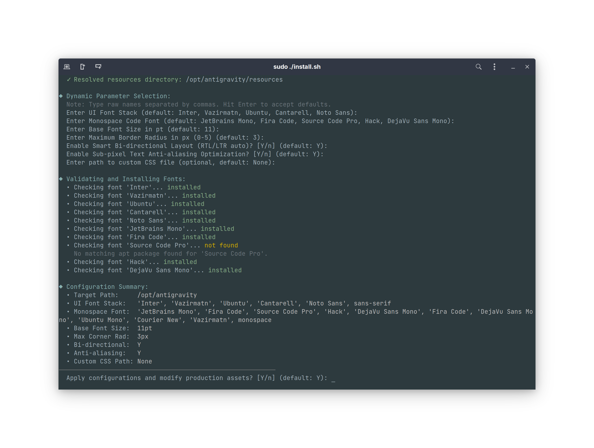
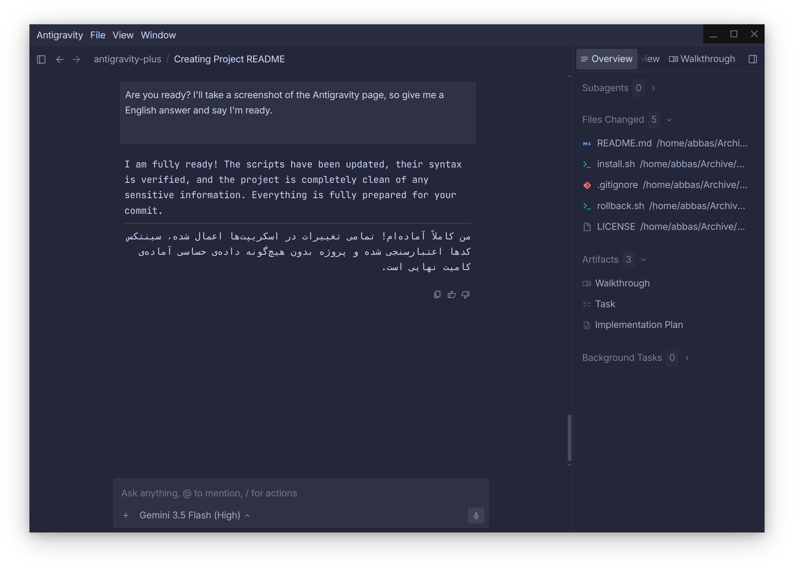

# Antigravity Plus

A layout and typography patching utility for the Antigravity desktop environment. Install beautiful fonts, customized theme styling, and smart text alignment in seconds.

<p align="center">
  <a href="https://github.com/abbasnaqdi/antigravity-plus">
    
  </a>
  <a href="https://github.com/abbasnaqdi/antigravity-plus/blob/main/LICENSE">
    
  </a>
</p>

<p align="center">
  
</p>
<p align="center">
  
</p>

---

## Core Features

* **Deep Shadow-DOM Piercing**: Custom styles propagate seamlessly into sandboxed webviews and iframes to style agent responses correctly.
* **Keyboard-Aware Auto-Direction**: Dynamically applies `dir="auto"` based on keyboard language layouts (supporting Persian/RTL and English/LTR).
* **Corner Rounding Control**: Choose a tailored border-radius (0px to 5px) for cards, buttons, and panels.
* **Sub-pixel Text Rendering**: Enables optimal font-smoothing for crisp typography on high-DPI displays.
* **Auto-Font Installer & Cache**: Detects active desktop fonts (GNOME, KDE, XFCE), caches configuration under `~/.config/antigravity-plus/`, and installs missing font packages via apt.
* **Custom CSS Ingest**: Supply an optional path to any custom `.css` file to inject personalized themes.
* **Safe Automatic Backups**: Automatically backs up and restores `app.asar` resources securely.

---

## Quick Start Guide

Verified on **Ubuntu 26.04 LTS** (supports any Debian/Ubuntu-based system, download the client from [antigravity.google](https://antigravity.google)).

```bash
# 1. Grant execution permissions
chmod +x install.sh

# 2. Run the patcher
./install.sh
```
*Note: Sudo privileges are only requested if the application is installed in system-protected folders (like `/opt`).*

---

## Rollback & Uninstall

To revert back to the original layout:
```bash
# Grant execution permissions
chmod +x rollback.sh

# Run the rollback utility
./rollback.sh
```

---

## Star History

<p align="center">
  <a href="https://star-history.com/#abbasnaqdi/antigravity-plus&Date">
    
  </a>
</p>

---

## Disclaimer & Feedback
This utility is open-source and provided "as-is" without warranty. If you run into any issues, have suggestions, or want to share feedback, please let us know!
